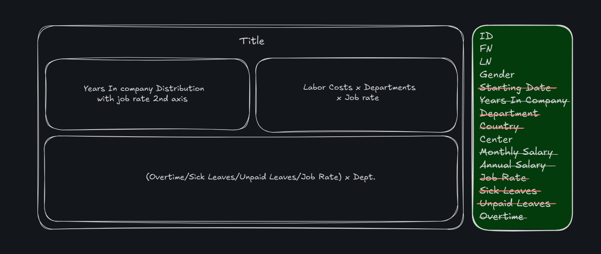

# HR Analysis

This project analyzes data from the **HR** sector. The analysis focuses on department performance, labor costs versus average performance rate, and year distribution with job rate using **Tableau** for data visualization.

---

## Project Overview

This analysis provides insights into HR efficiency, identifying key factors that impact employee performance and overall workforce productivity. The project aims to optimize HR operations and enhance decision-making processes.

## Key Objectives

-   Analyze department performance levels to identify trends and optimize workforce management.
-   Assess employee performance to ensure productivity and quality.
-   Utilize Tableau for interactive data visualization and reporting.

## Expected Outcomes

-   Improved workforce management strategies
-   Enhanced employee performance tracking
-   Increased operational efficiency
-   Data-driven decision-making capabilities

## Tools & Technologies

-   **Tableau**: Used for creating dashboards to analyze HR data.
-   **Excel**: Used for data exploration
-   **Figma**: Used for dashboard UI design

---

## Dashboard

### The Planning

### Implementation

---

---

## Insights

### Egypt Branch

**Labor Cost & Overtime Concerns:**

The manufacturing, quality control, and account management departments incurred disproportionately high overtime hours, contributing to elevated labor costs. Notably, the manufacturing department has the highest labor costs across all regional branches (including Saudi Arabia and UAE), despite Egypt’s workforce being three times larger.

**Work-Life Balance Issues:**

Elevated sick and unpaid leave rates in manufacturing suggest poor work-life balance, likely contributing to productivity losses and operational inefficiencies.

**Performance Deficiencies:**

Departments including R&D, training, environmental compliance, sales, IT, and marketing recorded performance ratings below 3.5 (on an unspecified scale), indicating systemic underperformance.

### Saudi Arabia Branch

**Overall Strong Performance:**

The branch is the top-performing region overall.

**Areas for Improvement:**

Major manufacturing projects, training, and green building departments require urgent review due to low performance ratings.

Quality control reported higher-than-average overtime hours, though not yet critical.

### UAE Branch

**Targeted Performance Gaps:**

Low ratings in research center, training, green buildings, and environmental compliance departments highlight gaps in compliance and innovation capabilities.

Other departments operate within acceptable parameters.

### Syria & Lebanon Branches

**Staffing Challenges:**

Both branches operate with limited headcount, leading to high performance volatility due to resource constraints.

**Syria:**

Critically low ratings in sales and green building departments necessitate immediate intervention.

**Lebanon:**

The marketing department underperforms significantly compared to regional benchmarks.

### Cross-Regional Observations

**Labor Cost Disparities:**

Egypt’s manufacturing department incurs outsized costs despite its larger workforce, suggesting inefficiencies in workflow or resource allocation.

Smaller branches (Syria, Lebanon) struggle with consistency due to staffing shortages.

**Common Weaknesses:**

Training and green building initiatives underperform across multiple regions (Egypt, Saudi Arabia, UAE), indicating a systemic gap in skills development and sustainability practices.

### Recommendations

**Operational Efficiency Review:**

-   Audit Egypt’s manufacturing workflows to reduce overtime and labor costs.
-   Implement work-life balance initiatives (e.g., flexible scheduling) to curb absenteeism.

**Performance Improvement Plans:**

-   Prioritize training and compliance departments for upskilling programs.
-   Address green building and sustainability gaps through targeted investments.

**Regional Resource Allocation:**

-   Rebalance staffing in smaller branches (Syria, Lebanon) to stabilize performance.
-   Share best practices from Saudi Arabia’s high-performing teams with other regions.

> **Calculation Assumption:** The labor costs were calculated based on the assumption that the standard work hours are 40 hours per week. Overtime hours were calculated at a rate of 1.5 times the regular hourly rate.

## Explore the Dashboard

You can explore the interactive HR Analysis dashboard by following [this link](https://public.tableau.com/app/profile/abdullah.elhelw/viz/HRAnalysis_17379617138080/Dashboard1?publish=yes). The dashboard provides a comprehensive view of the data, allowing you to:

-   Filter by department and region.
-   Visualize labor costs, overtime hours, and performance ratings.
-   Identify trends and patterns across different branches.
-   Gain insights into workforce productivity and operational efficiency.

Feel free to interact with the visualizations to uncover deeper insights and make data-driven decisions.
